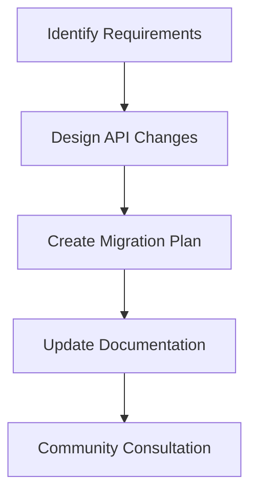
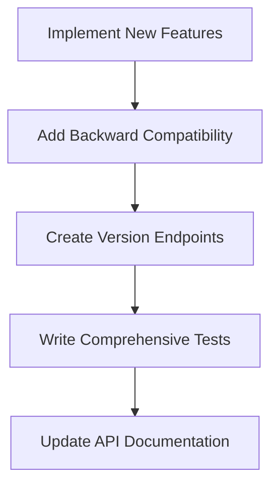
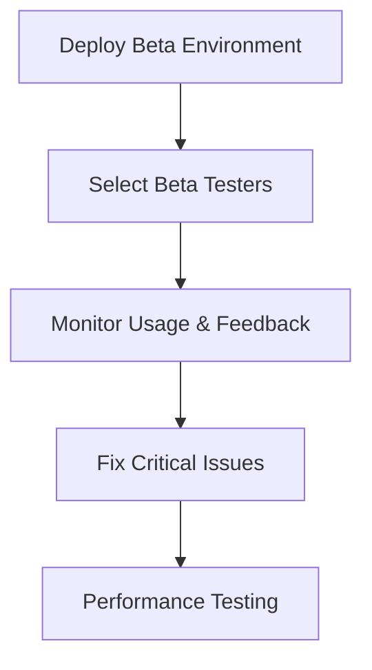
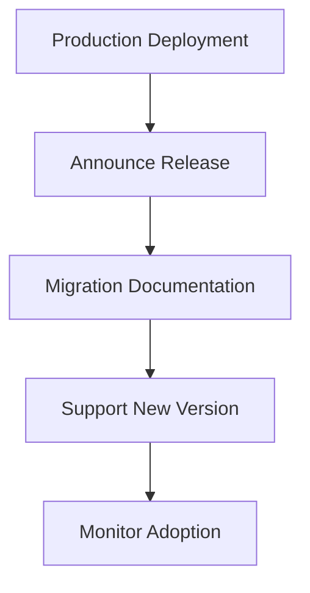

# API Versioning Strategy

This document outlines the comprehensive API versioning strategy for the STEM
Toys E-Commerce platform, ensuring backward compatibility, smooth migrations,
and long-term API evolution.

## Versioning Philosophy

### Core Principles

1. **Backward Compatibility First**: Existing clients continue working without
   changes
2. **Explicit Version Adoption**: New features require explicit opt-in
3. **Graceful Deprecation**: Old versions supported during transition periods
4. **Clear Communication**: Version changes clearly documented and announced
5. **Automated Migrations**: Tools provided for smooth version transitions

### Version Lifecycle

```
Planning → Development → Beta → Stable → Deprecated → Retired
   ↓          ↓          ↓        ↓          ↓          ↓
   3mo        2mo        1mo      12mo       6mo        ∞
```

## Versioning Schemes

### URL Path Versioning (Primary)

API versions are indicated in the URL path:

```
/api/v1/auth/register
/api/v2/auth/register
/api/v3/auth/register
```

**Current Version:** v1 (as of 2025) **Latest Stable:** v1 **Beta Versions:**
None

### Header-Based Versioning (Secondary)

Accept header versioning for fine-grained control:

```http
Accept: application/vnd.stemtoys.v1+json
Accept: application/vnd.stemtoys.v2+json
```

### Query Parameter Versioning (Fallback)

Query parameter for simple versioning:

```
/api/auth/register?version=1
/api/auth/register?version=2
```

## Version Numbering

### Semantic Versioning

We use a modified semantic versioning scheme:

```
MAJOR.MINOR.PATCH
```

- **MAJOR**: Breaking changes (authentication, core data models)
- **MINOR**: New features, backward-compatible additions
- **PATCH**: Bug fixes, security updates, minor improvements

### Current Version Status

| Version | Status   | Release Date | End of Life | Description                                                  |
| ------- | -------- | ------------ | ----------- | ------------------------------------------------------------ |
| v1      | Stable   | 2025-01-01   | 2026-12-31  | Initial release with multi-tenant, GDPR, Romanian compliance |
| v2      | Planning | 2026-01-01   | TBD         | Advanced analytics, AI-powered personalization               |

## API Evolution Guidelines

### Backward Compatible Changes ✅

These changes can be made without version increment:

1. **Additive Changes**
   - New optional request fields
   - New response fields
   - New endpoints
   - New query parameters

2. **Performance Improvements**
   - Response time optimizations
   - Caching improvements
   - Database query optimizations

3. **Bug Fixes**
   - Error message improvements
   - Validation fixes
   - Security patches

### Breaking Changes ❌

These require a new major version:

1. **Data Model Changes**
   - Required field additions
   - Field type changes
   - Field removals

2. **Authentication Changes**
   - Token format changes
   - Authentication flow modifications
   - Permission model changes

3. **API Contract Changes**
   - Endpoint URL changes
   - HTTP method changes
   - Response format changes

4. **Behavioral Changes**
   - Default value changes
   - Validation rule changes
   - Error code changes

## Version Release Process

### 1. Planning Phase (3 months before)



**Activities:**

- Feature requirements gathering
- API design review
- Breaking change impact analysis
- Migration path planning
- Developer community consultation

### 2. Development Phase (2 months)



**Activities:**

- Implement new features in new version
- Maintain backward compatibility in current version
- Create version-specific endpoints
- Comprehensive test coverage
- Update OpenAPI specifications

### 3. Beta Phase (1 month)



**Activities:**

- Beta environment deployment
- Selected developer access
- Usage monitoring and feedback collection
- Critical bug fixes
- Performance and load testing

### 4. Stable Release



**Activities:**

- Production deployment
- Release announcement
- Migration guides and tools
- Support for both versions
- Adoption monitoring

## Migration Strategies

### Parallel Support

Both old and new versions run simultaneously:

```
/api/v1/users (legacy)
/api/v2/users (new)
```

### Gradual Migration

1. **Week 1-2**: New version available, old version stable
2. **Week 3-4**: Encourage migration, old version deprecated
3. **Month 2**: Old version maintenance mode
4. **Month 6**: Old version retired

### Migration Tools

#### Automated Migration Script

```typescript
class APIMigrator {
  async migrateClient(clientVersion: string): Promise<string> {
    switch (clientVersion) {
      case "v1":
        return this.migrateFromV1();
      case "v2":
        return "latest";
      default:
        throw new Error(`Unsupported version: ${clientVersion}`);
    }
  }

  private async migrateFromV1(): Promise<string> {
    // Check client compatibility
    const compatibility = await this.checkV1Compatibility();

    if (compatibility.canMigrate) {
      // Update client configuration
      await this.updateClientConfig("v2");
      return "v2";
    } else {
      // Provide migration instructions
      throw new Error("Manual migration required. See migration guide.");
    }
  }
}
```

#### Migration Assessment API

```typescript
// GET /api/migration/assess
{
  "currentVersion": "v1",
  "targetVersion": "v2",
  "compatibility": {
    "compatible": true,
    "warnings": [
      "New authentication flow recommended"
    ],
    "breakingChanges": [],
    "migrationSteps": [
      "Update client library to v2.x.x",
      "Review new authentication requirements",
      "Test in staging environment"
    ]
  },
  "estimatedEffort": "2 hours",
  "recommendedTimeline": "2 weeks"
}
```

## Version Detection and Routing

### Server-Side Version Detection

```typescript
// Version detection middleware
export function versionDetectionMiddleware(req: NextRequest) {
  // 1. URL path versioning (highest priority)
  const urlVersion = req.nextUrl.pathname.match(/^\/api\/v(\d+)\//)?.[1];

  // 2. Accept header versioning
  const acceptVersion = req.headers
    .get("accept")
    ?.match(/vnd\.stemtoys\.v(\d+)/)?.[1];

  // 3. Query parameter versioning
  const queryVersion = req.nextUrl.searchParams.get("version");

  // 4. Default to latest stable
  const detectedVersion = urlVersion || acceptVersion || queryVersion || "1";

  // Validate version exists
  if (!SUPPORTED_VERSIONS.includes(`v${detectedVersion}`)) {
    return new Response(
      JSON.stringify({
        error: "Unsupported API version",
        supportedVersions: SUPPORTED_VERSIONS,
        requestedVersion: `v${detectedVersion}`,
      }),
      {
        status: 400,
        headers: { "Content-Type": "application/json" },
      }
    );
  }

  // Add version to request context
  req.version = `v${detectedVersion}`;
  return NextResponse.next();
}
```

### Client-Side Version Specification

```typescript
class APIClient {
  constructor(version: string = "v1") {
    this.version = version;
    this.baseURL = `https://stemtoys.ro/api/${version}`;
  }

  // Version-aware request method
  async request(endpoint: string, options: RequestInit = {}) {
    const url = `${this.baseURL}${endpoint}`;

    const headers = {
      "Content-Type": "application/json",
      "X-API-Version": this.version,
      ...options.headers,
    };

    // Add authentication
    if (this.token) {
      headers["Authorization"] = `Bearer ${this.token}`;
    }

    const response = await fetch(url, {
      ...options,
      headers,
    });

    // Handle version-specific responses
    return this.handleVersionedResponse(response);
  }

  private handleVersionedResponse(response: Response) {
    const apiVersion = response.headers.get("X-API-Version");

    // Version-specific response processing
    switch (apiVersion) {
      case "v1":
        return this.processV1Response(response);
      case "v2":
        return this.processV2Response(response);
      default:
        return this.processLegacyResponse(response);
    }
  }
}
```

## Deprecation and Retirement

### Deprecation Process

1. **Announcement (6 months before retirement)**
   - Email to registered developers
   - Documentation updates with deprecation notices
   - Migration guides published

2. **Deprecation Warnings**

   ```http
   Deprecation: This API version will be retired on 2026-12-31. Please migrate to v2.
   Link: /docs/migration/v1-to-v2
   ```

3. **Maintenance Mode (3 months before retirement)**
   - Only security fixes and critical bugs addressed
   - New features only available in newer versions
   - Performance optimizations halted

4. **Retirement**
   - API returns 410 Gone status
   - Clear error message with migration instructions
   - Support redirects to current version

### Retirement Response

```typescript
// Retired version response
export function retiredVersionHandler(req: NextRequest) {
  const retiredVersion = req.version;
  const currentVersion = getCurrentVersion();

  return new Response(
    JSON.stringify({
      error: "API version retired",
      retiredVersion,
      currentVersion,
      migrationGuide: `/docs/migration/${retiredVersion}-to-${currentVersion}`,
      sunsetDate: "2026-12-31T23:59:59Z",
      supportContact: "api@stemtoys.ro",
    }),
    {
      status: 410, // Gone
      headers: {
        "Content-Type": "application/json",
        "X-API-Version": currentVersion,
        Link: `</docs/migration/${retiredVersion}-to-${currentVersion}>; rel="migration-guide"`,
      },
    }
  );
}
```

## Version Management Tools

### Version Status Dashboard

```typescript
// GET /api/versions/status
{
  "versions": {
    "v1": {
      "status": "stable",
      "releaseDate": "2025-01-01",
      "deprecationDate": "2026-12-31",
      "retirementDate": "2027-06-30",
      "supported": true,
      "recommended": false
    },
    "v2": {
      "status": "beta",
      "releaseDate": "2026-01-01",
      "deprecationDate": null,
      "retirementDate": null,
      "supported": true,
      "recommended": true
    }
  },
  "current": "v1",
  "latest": "v2",
  "upcoming": ["v3"]
}
```

### Version Compatibility Checker

```typescript
interface CompatibilityCheck {
  clientVersion: string;
  serverVersion: string;
  compatible: boolean;
  issues: string[];
  recommendations: string[];
}

export function checkVersionCompatibility(
  clientVersion: string,
  serverVersion: string
): CompatibilityCheck {
  const issues: string[] = [];
  const recommendations: string[] = [];

  // Version compatibility logic
  if (clientVersion === "v1" && serverVersion === "v2") {
    issues.push("Authentication flow changes in v2");
    recommendations.push("Review authentication implementation");
  }

  return {
    clientVersion,
    serverVersion,
    compatible: issues.length === 0,
    issues,
    recommendations,
  };
}
```

## Developer Experience

### Version Selection UI

```tsx
// Version selector component
export default function VersionSelector({ currentVersion, onVersionChange }) {
  const versions = [
    { id: "v1", name: "Version 1 (Stable)", status: "stable" },
    { id: "v2", name: "Version 2 (Beta)", status: "beta" },
  ];

  return (
    <select
      value={currentVersion}
      onChange={e => onVersionChange(e.target.value)}
      className="version-selector"
    >
      {versions.map(version => (
        <option key={version.id} value={version.id}>
          {version.name}
          {version.status === "beta" && " 🧪"}
        </option>
      ))}
    </select>
  );
}
```

### Migration Assistant

```typescript
class MigrationAssistant {
  async analyzeClient(code: string): Promise<MigrationReport> {
    const issues: MigrationIssue[] = [];

    // Analyze code for version-specific patterns
    if (code.includes("/api/v1/")) {
      issues.push({
        type: "url_versioning",
        severity: "medium",
        message: "Update API URLs to use latest version",
        fix: "Replace /api/v1/ with /api/v2/",
      });
    }

    if (code.includes("oldAuthMethod")) {
      issues.push({
        type: "authentication",
        severity: "high",
        message: "Authentication method deprecated",
        fix: "Use new OAuth2 flow",
      });
    }

    return {
      compatible: issues.length === 0,
      issues,
      estimatedEffort: this.calculateEffort(issues),
      migrationSteps: this.generateSteps(issues),
    };
  }
}
```

## Monitoring and Analytics

### Version Usage Metrics

```typescript
interface VersionMetrics {
  version: string;
  requestCount: number;
  errorRate: number;
  avgResponseTime: number;
  uniqueClients: number;
  adoptionRate: number;
}

export function trackVersionUsage(req: NextRequest, res: NextResponse) {
  const version = req.version;
  const clientId = req.headers.get("X-Client-ID");

  // Track version usage
  metrics.increment(`api.version.${version}.requests`);
  metrics.histogram(`api.version.${version}.response_time`, responseTime);

  if (res.status >= 400) {
    metrics.increment(`api.version.${version}.errors`);
  }

  // Track client adoption
  if (clientId) {
    metrics.set(`client.${clientId}.version`, version);
  }
}
```

### Migration Funnel Analytics

```typescript
interface MigrationFunnel {
  stage: "aware" | "interested" | "testing" | "migrating" | "migrated";
  clients: number;
  conversionRate: number;
  avgTimeInStage: number;
}

export function trackMigrationProgress() {
  // Track migration funnel
  const funnel: MigrationFunnel[] = [
    { stage: "aware", clients: 1000, conversionRate: 0.8 },
    { stage: "interested", clients: 800, conversionRate: 0.6 },
    { stage: "testing", clients: 480, conversionRate: 0.4 },
    { stage: "migrating", clients: 192, conversionRate: 0.8 },
    { stage: "migrated", clients: 154, conversionRate: 1.0 },
  ];

  return funnel;
}
```

## Best Practices

### For API Providers

1. **Plan Versions Carefully**: Consider long-term implications
2. **Communicate Early**: Give developers ample migration time
3. **Provide Tools**: Migration assistants and compatibility checkers
4. **Monitor Usage**: Track version adoption and issues
5. **Support Legacy**: Maintain old versions during transition

### For API Consumers

1. **Stay Updated**: Monitor API changelog and announcements
2. **Test Migrations**: Use beta environments for testing
3. **Plan Migrations**: Allocate time for version upgrades
4. **Use Version Headers**: Specify desired API version explicitly
5. **Monitor Deprecations**: Watch for deprecation warnings

### Version Pinning Strategy

```typescript
// Version pinning configuration
export const API_CONFIG = {
  // Pin to specific version for stability
  version: "v1",

  // Allow automatic minor version updates
  allowMinorUpdates: true,

  // Require manual approval for major updates
  requireMajorApproval: true,

  // Fallback version if pinned version unavailable
  fallbackVersion: "v1",
};
```

This comprehensive versioning strategy ensures smooth API evolution while
maintaining backward compatibility and providing clear migration paths for
developers.
