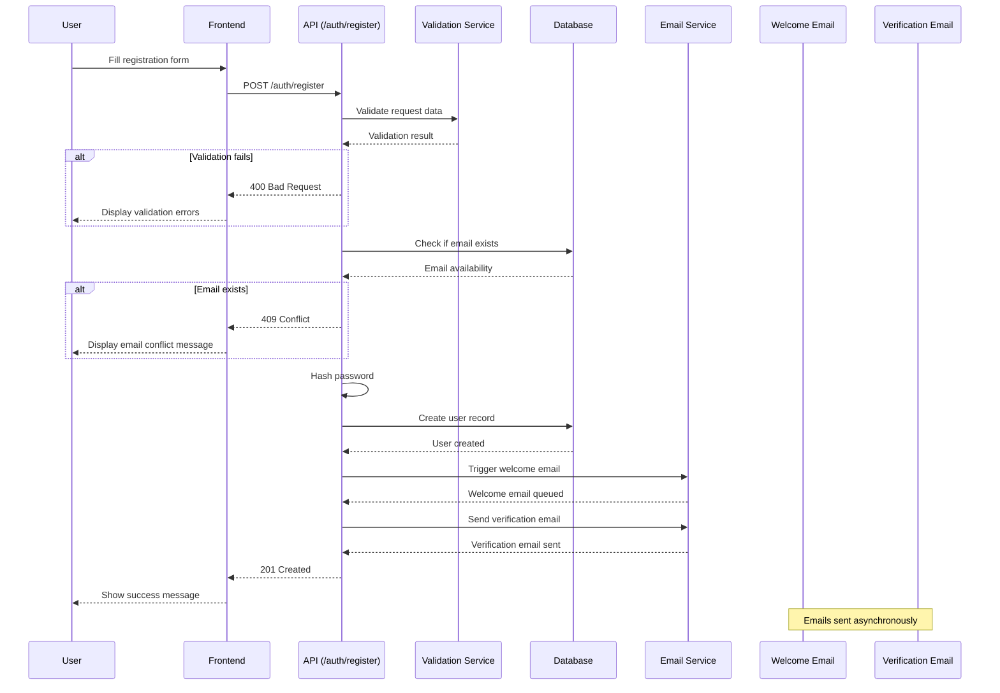
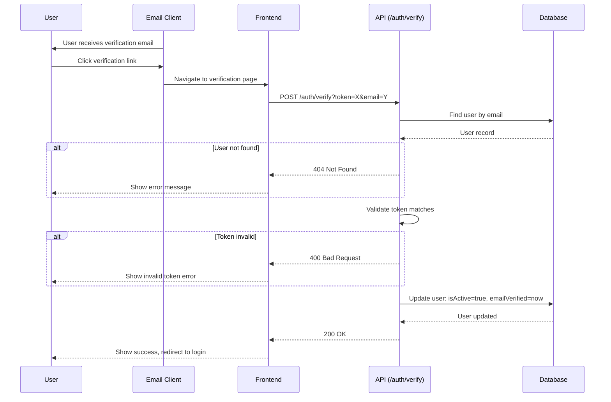
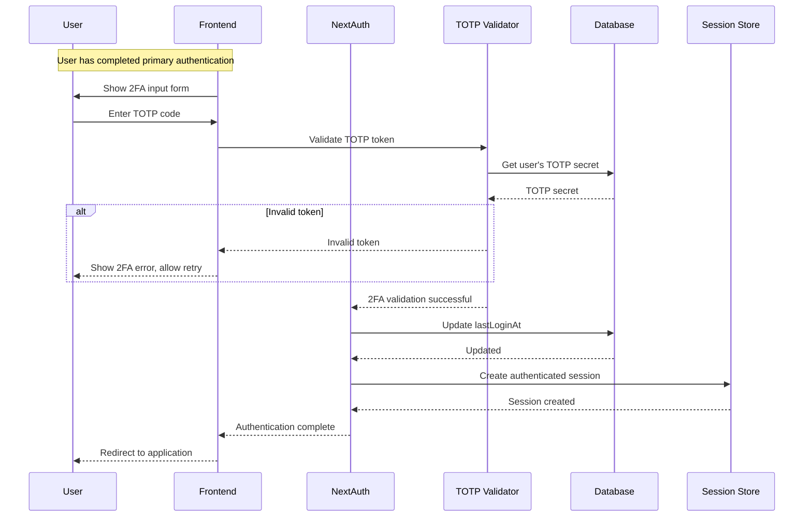
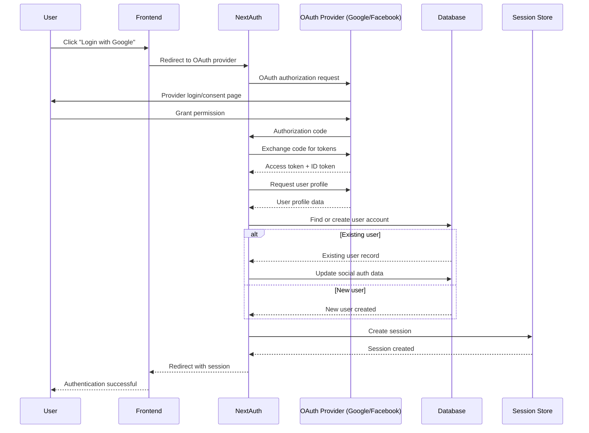
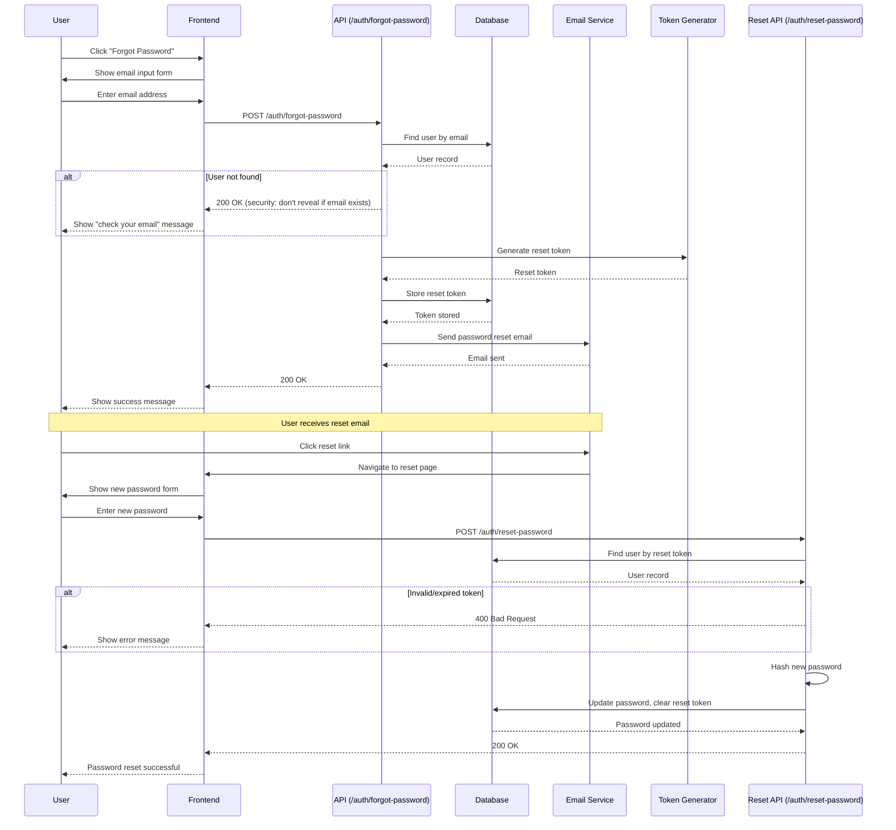
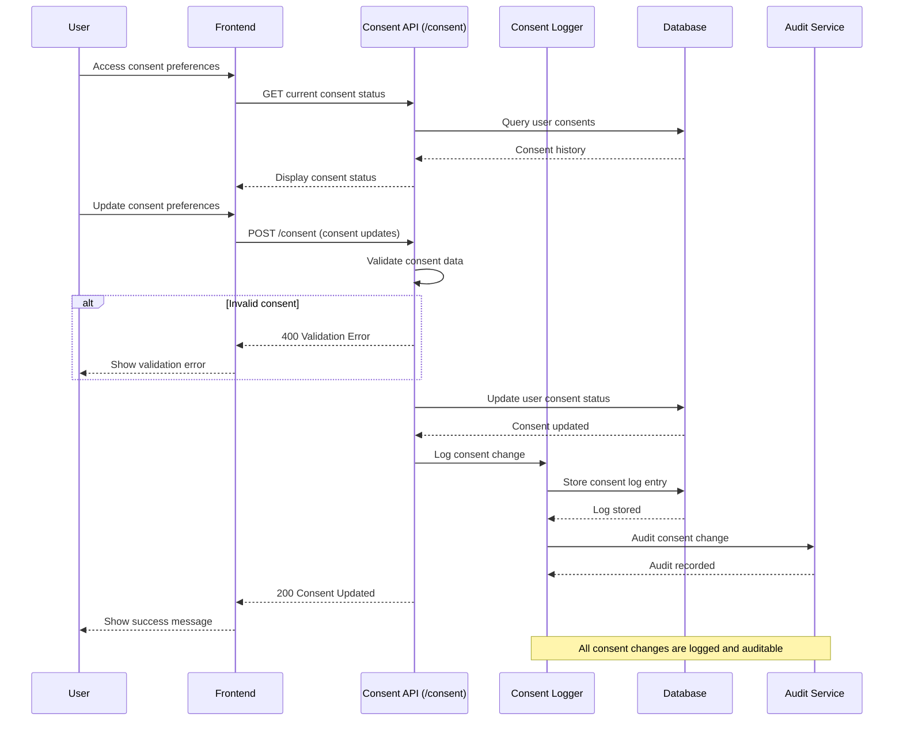

# Authentication Flows Documentation

## Overview

This document outlines the authentication flows for the STEM Toys E-Commerce
platform, including sequence diagrams for key authentication processes. The
system supports multiple authentication methods including traditional
email/password, social authentication, and two-factor authentication.

## Authentication Architecture

The authentication system is built on NextAuth.js with custom extensions for
Romanian market compliance and advanced security features. It includes:

- **Multi-tenant architecture** with tenant isolation
- **GDPR compliance** with consent management
- **Social authentication** (Google, Facebook, Apple, Romanian providers)
- **Two-factor authentication** (TOTP)
- **Advanced security** with rate limiting and account lockouts
- **Romanian market compliance** with local identity providers

## Sequence Diagrams

### 1. User Registration Flow



### 2. Email Verification Flow



### 3. Login Flow (Traditional)

```mermaid
sequenceDiagram
    participant U as User
    participant F as Frontend
    participant N as NextAuth
    participant DB as Database
    participant S as Session Store
    participant L as Lockout Check
    participant R as Rate Limiter

    U->>F: Enter credentials
    F->>N: POST /api/auth/callback/credentials
    N->>R: Check rate limit

    alt Rate limit exceeded
        R-->>N: Rate limit error
        N-->>F: 429 Too Many Requests
        F-->>U: Show rate limit message
    end

    N->>DB: Find user by email
    DB-->>N: User record

    alt User not found
        N-->>F: Invalid credentials
        F-->>U: Show login error
    end

    N->>L: Check account lockout status
    alt Account locked
        L-->>N: Account locked
        N-->>F: Account locked error
        F-->>U: Show lockout message
    end

    N->>N: Verify password hash

    alt Password invalid
        N->>DB: Increment failed login attempts
        DB-->>N: Attempts updated
        N-->>F: Invalid credentials
        F-->>U: Show login error
    end

    N->>DB: Reset failed attempts, update lastLoginAt
    DB-->>N: User updated

    alt 2FA enabled
        N-->>F: Require 2FA challenge
        F-->>U: Show 2FA input
        Note right: Continue to 2FA flow
    end

    N->>S: Create session
    S-->>N: Session created
    N-->>F: Authentication successful
    F-->>U: Redirect to dashboard
```

### 4. Two-Factor Authentication Flow



### 5. Social Authentication Flow (OAuth)



### 6. Password Reset Flow



### 7. Multi-Tenant Authentication Flow

```mermaid
sequenceDiagram
    participant U as User
    participant F as Frontend
    participant M as Middleware
    participant A as API
    participant T as Tenant Service
    participant DB as Database
    participant S as Session Store

    U->>F: Access application
    F->>M: Request with tenant context
    M->>T: Resolve tenant from subdomain/domain

    alt Invalid tenant
        T-->>M: Tenant not found
        M-->>F: 404 Tenant Not Found
        F-->>U: Show tenant error
    end

    T-->>M: Tenant information
    M->>A: API request with tenant context

    A->>DB: Query with tenant isolation
    Note right: All queries include tenantId filter

    DB-->>A: Tenant-scoped data
    A-->>M: Response
    M-->>F: Tenant-aware response
    F-->>U: Display tenant-specific content

    Note over S: Session includes tenant context
```

### 8. GDPR Consent Management Flow



## Security Features

### Rate Limiting

- **Registration**: 5 requests per IP per 15 minutes
- **Login attempts**: Progressive delays after failed attempts
- **Password reset**: 3 requests per email per hour
- **API endpoints**: Configurable per endpoint

### Account Security

- **Password hashing**: bcrypt with salt rounds
- **Session management**: Secure HTTP-only cookies
- **CSRF protection**: Token-based validation
- **Account lockout**: After 5 failed login attempts
- **Suspicious activity monitoring**: IP tracking and anomaly detection

### Multi-Tenant Isolation

- **Data segregation**: All queries include tenant context
- **Access control**: Users can only access their tenant's data
- **Audit logging**: All cross-tenant operations logged
- **Resource limits**: Per-tenant resource quotas

## Error Handling

### Authentication Errors

- `400`: Invalid credentials or malformed request
- `401`: Authentication required or invalid session
- `403`: Insufficient permissions or tenant access denied
- `409`: Email already exists (registration)
- `429`: Rate limit exceeded
- `500`: Server error during authentication

### Validation Errors

- **Registration**: Name, email, password validation
- **Profile Update**: Email uniqueness, password strength
- **Address**: Romanian postal code validation
- **Consent**: Required GDPR consent fields

## Romanian Compliance

### Identity Validation

- **CNP validation**: Romanian personal numerical code format
- **CUI validation**: Romanian tax identification number
- **Address validation**: Romanian postal codes and counties
- **Age verification**: For users under 18 (parental consent required)

### Data Localization

- **Romanian data residency**: Data stored in EU-compliant regions
- **ANSPDCP compliance**: Romanian data protection authority requirements
- **Fiscal compliance**: Romanian tax law requirements for B2B

## Monitoring and Logging

### Authentication Events

- Successful logins (with IP, user agent)
- Failed login attempts
- Account lockouts
- Password resets
- Session creation/destruction
- 2FA setup and usage

### Security Alerts

- Multiple failed login attempts
- Suspicious IP addresses
- Unusual login patterns
- Consent withdrawals
- Account deletions

## API Rate Limits

```yaml
# Rate limiting configuration
auth:
  registration: "5 per 15min per IP"
  login: "10 per 5min per IP"
  password_reset: "3 per hour per email"
  api_general: "100 per min per user"
  api_admin: "1000 per min per admin"

# Progressive delays for failed logins
login_delays:
  attempt_1: 0s
  attempt_2: 1s
  attempt_3: 5s
  attempt_4: 15s
  attempt_5: 60s
  lockout: 30min
```

## Testing Scenarios

### Happy Path Tests

1. Successful registration → email verification → login
2. Social authentication flow completion
3. 2FA setup and login verification
4. Password reset flow
5. Profile updates with validation

### Error Path Tests

1. Invalid email formats
2. Weak passwords
3. Expired verification tokens
4. Rate limit violations
5. Account lockout scenarios
6. Cross-tenant access attempts

### Security Tests

1. SQL injection attempts
2. XSS in user inputs
3. CSRF token validation
4. Session fixation attacks
5. Brute force protection

## Performance Considerations

### Caching Strategy

- User sessions cached in Redis
- User profile data cached with TTL
- Tenant configuration cached
- Rate limit counters cached

### Database Optimization

- User table indexed by email, tenantId
- Composite indexes for common queries
- Read replicas for authentication checks
- Connection pooling for high concurrency

### Scalability Features

- Horizontal database sharding by tenant
- Redis cluster for session storage
- CDN for static authentication assets
- Load balancing for API endpoints
