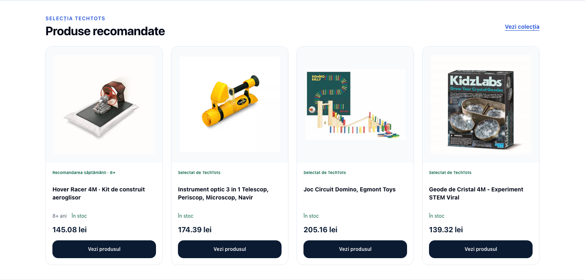
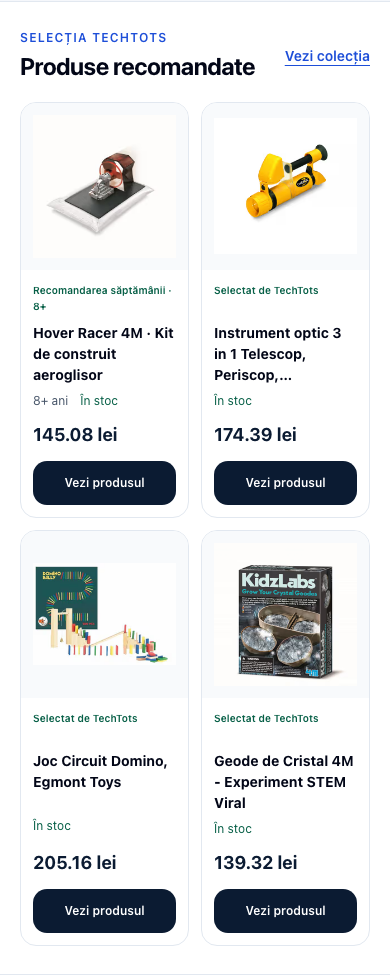

# Product-led homepage restoration — 9 September 2026

Restores the approved product-led homepage from commit `77f340c` onto current remote main (`5b04254`) and replaces its rejected SKU hero with one crafted navy/mint paper gift scene. The unrelated local auth commit and dirty user checkout are preserved.

## Final behavior

- Immediate “STEM fără ecran” headline, catalog and Cadouri 6–8 CTAs, COD and 1–4 working-day delivery copy.
- Brand scene: 1200 × 800 WebP, approximately 57 KB. Static server-rendered first paint, then a 12-second CSS scale from 1 to 1.025. Manual pause, reduced-motion, offscreen and hidden-tab support. No video, audio, animation dependency, fake child or invented product.
- Hover Racer remains the first available recommendation, labelled “Recomandarea săptămânii · 8+”, with genuine product image, database price/stock and PDP links. Other cards omit age when a verified age is unavailable; broad catalog filter buckets are not presented as manufacturer ages.
- Keyboard/touch age chips, four unique product cards, one resource row, Ghid STEM 2026 and permanent redirect from 2025. No fabricated 50,000 claim or homepage promotional overlay.
- Social preview uses the same new brand asset.

[Asset provenance and exact generation prompt](./brand-asset.md).

## Verification

Production preview uses existing catalog credentials with PostgreSQL `default_transaction_read_only=on`. No migration or data write is part of this change. The verification build runs `next build` directly because the package build wrapper also runs migrations.

Focused ESLint: zero errors and zero warnings. Five Jest suites / seven tests pass, covering hero shopping paths and brand asset, accessible section naming, current guide/resource links existing Cristale content integrity, and exclusion of unverified catalog age buckets. Jest uses `--forceExit` for the repository's existing open handles.

Commands:

```sh
pnpm exec next build
pnpm exec jest --runInBand --forceExit --runTestsByPath __tests__/features/home/components/HeroSection.test.tsx __tests__/features/home/components/HeroSection.a11y.test.tsx __tests__/features/home/PillarSection.test.tsx __tests__/lib/seo/cristale-product-integrity.test.ts
PLAYWRIGHT_SKIP_WEBSERVER=true PLAYWRIGHT_BASE_URL=http://127.0.0.1:3100 pnpm exec playwright test e2e/homepage-conversion.spec.ts --project=chromium --workers=1
```

Repository-wide typecheck reports 1,184 diagnostics, including existing translation-key, Prisma and web-vitals issues. The changed homepage implementation files have no reported type errors. This is not a green repository-wide check; the existing broad Git hooks are bypassed with the focused verification documented here.

Final production build passed (380 routes). All six Playwright checks passed against the production preview, including real destination navigation, mobile layout, keyboard/touch age chips, pause/reduced motion, no-JS first paint, and promotional-overlay absence. Desktop and mobile captures contain no runtime errors, broken images or horizontal overflow.

## Screenshots

Desktop 1440 × 900 and mobile 390 × 844. Captured with reduced motion to show the static composition. Product-grid captures isolate the section and suppress the sticky header during capture so it does not cover the heading.






[Full desktop page](./desktop.png) · [Full mobile page](./mobile.png)

The Lighthouse summary is historical evidence from the 7 September restoration branch; those figures were not remeasured for this new hero asset.
