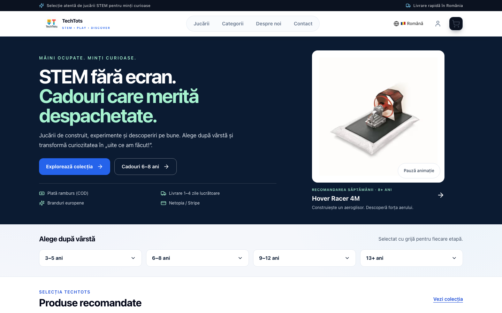

# Homepage conversion QA — 7 September 2026

## Implementation

- Navy / blue / mint hero with immediately visible Romanian headline, catalog and 6–8 gift CTAs, and COD / delivery / payments trust copy.
- One CSS transform animation of the existing Hover Racer product photograph. This is a product-photo preview, **not demo footage**. Local WebP: 15,116 bytes. No player, animation library or video request. Reserved square frame; static server-rendered fallback; reduced-motion, offscreen, hidden-tab and manual pause support.
- Accessible age buttons with hover previews, touch toggling, Enter/Space and Escape, and links to the existing age-filtered catalog.
- Four unique, available products selected from approved inventory; Hover Racer SKU `4M-03366` takes first position independently of the `featured` flag. Its supplier description specifies **8+**, used instead of the broader database age bucket. Prices and stock come from the database, without fake ratings or popularity claims.
- Recommendations stream through Suspense; database delays do not gate hero HTML. Five-minute product cache; bounded request wait and an honest catalog fallback on failure.
- One theme row: gifts, STEM benefits, FAQ, 2026 guide. Previous guide URL permanently redirects to the 2026 edition.
- Hero and footer share `heroTrust2`: **Livrare 1–4 zile lucrătoare**. Newsletter removes the unsupported 50,000-person claim and uses natural unsubscribe copy. Footer legal COD wording is retained.
- Homepage promotional modal and sticky promotional overlay are disabled so the product-photo animation is the only unsolicited interest trigger.

## Verification environment

The existing local PostgreSQL snapshot predates Hover Racer. Production-data verification uses a direct PostgreSQL connection with `default_transaction_read_only=on`, verified with `SHOW default_transaction_read_only`. No production records, schema or migrations were changed. The isolated checkout uses symlinks to the existing local environment files; their contents are unchanged.

The repository's `pnpm build` script includes migrations. Verification calls `next build` directly after `prisma generate`, avoiding migrations.

A pre-existing build blocker imported `google-auth-library` without declaring it as a direct dependency. The Search Console service now uses the identical `Auth.JWT` export from its existing `googleapis` dependency.

## Reproduce browser checks

With a running preview containing current catalog data:

```sh
PLAYWRIGHT_SKIP_WEBSERVER=true PLAYWRIGHT_BASE_URL=http://127.0.0.1:3000 pnpm exec playwright test e2e/homepage-conversion.spec.ts --project=chromium --workers=1
```

Tests cover product order and honest copy, all four age paths with keyboard interaction, touch toggling, two-column mobile cards, equal heights, horizontal overflow, animation pause/resume and reduced-motion, and headline/CTA visibility with JavaScript disabled.

## Asset source

The hero photograph is the existing Hover Racer supplier image already associated with the product in the catalog:
https://gomagcdn.ro/domains/kidstory.ro/files/product/original/kit-constructie-robot-hover-racer-kidz-robotix-12127-5155.jpg

Resized to 640 × 640 and encoded as WebP, quality 82. No generated product depiction or performance claim is used.


## Branch isolation

The PR is based on `origin/main` at `5b04254`, including the existing gift landing page and product content-integrity corrections. The homepage recommendation mapper applies the same catalog content overrides as the storefront (including the corrected Cristale manufacturer age). The original `STEM-TOYS3` checkout, its local auth commit, staged package files, shipping work and other user changes were preserved; its unstaged patch was compared byte-for-byte with the pre-task snapshot after moving the work here.


## Results

- Production build: **passed**, 380 routes generated. The fresh isolated build needed `NODE_OPTIONS=--max-old-space-size=6144` after the default heap was exhausted.
- Browser suite: **6 passed**, 22.8 seconds, against the production build. Includes actual destination navigation and legacy-guide redirect.
- Existing Cristale product-integrity suite: **3 passed**. `--forceExit` was used because the existing Jest setup leaves background handles open.
- Focused ESLint: **0 errors**; one non-blocking existing-style preference for `??` over `||` in the image fallback.
- Desktop (1440 × 900) and mobile (390 × 844): no runtime page errors, broken images or horizontal overflow. Both footer delivery references resolve to 1–4 working days. Product heading starts at 852 px on desktop and 1415 px on mobile, within the first downward viewport scroll.
- Repository-wide typecheck remains red (1,185 diagnostics in the starting checkout, including existing duplicate translation keys, Prisma enum imports and `web-vitals` typings). The changed homepage components have no reported type errors. This PR does not claim a green repository-wide typecheck. The draft commit skips the existing full-repository pre-commit hook; targeted checks above were run explicitly.

### Mobile Lighthouse

Lighthouse 12.8.2, default simulated mobile throttling, two interleaved runs per URL on the same machine. Raw metric summaries are in [lighthouse-summary.json](./lighthouse-summary.json).

| Metric | Live homepage, runs 1 / 2 | Local production preview, runs 1 / 2 |
| --- | --- | --- |
| Performance | 55 / 73 | 73 / 90 |
| Accessibility | 92 / 92 | 100 / 100 |
| LCP | 12.38 s / 5.87 s | 6.66 s / 3.10 s |
| First contentful paint | 4.39 s / 1.25 s | 1.37 s / 1.37 s |
| Total blocking time | 217 ms / 131 ms | 228 ms / 215 ms |
| CLS | 0 / 0.017 | 0.017 / 0.017 |
| Transferred data | 2.52 MB / 2.52 MB | 0.94 MB / 0.94 MB |

Performance scores improved in both paired runs; transferred data fell approximately 62.5%. These are lab results, not field Core Web Vitals. The preview uses localhost and read-only database access while the baseline is hosted, so network/cache conditions differ. LCP still exceeds the repository's aspirational 2.5-second budget, and blocking time remains around 200 ms; production should be remeasured after deployment. Analytics writes were intentionally rejected by the read-only verification database and are not production failures.

### Screenshots

[Desktop full page](./desktop.png) · [Mobile full page](./mobile.png)




