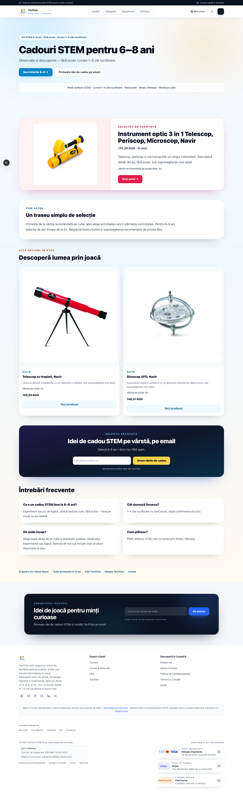
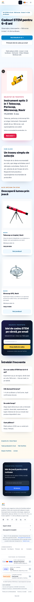
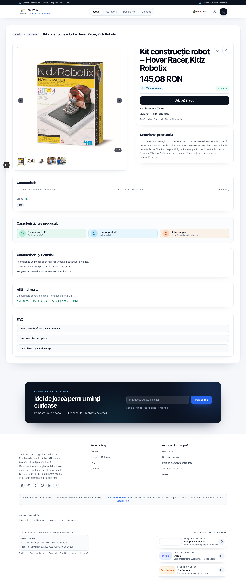
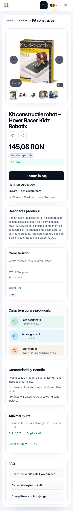
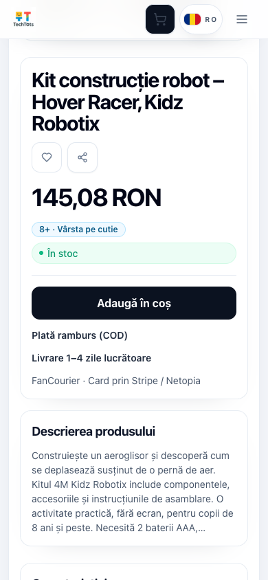

# Conversion copy and Hover Racer review

Reviewed against live techtots.ro pages on 2026-09-08. Changes are in an isolated branch based on `origin/main` (`5b04254`).

## Changes

- Gift page metadata, hero, FAQ, trust strip and JSON-LD use “1–4 zile lucrătoare”. The same promise replaces conflicting storefront translation, regional SEO and shipping-page copy.
- The gift selection starts with Navir instrument `N_8097`, labeled “Selectat de TechTots”. Read-only catalog inspection confirmed its active/approved status, positive stock and supplier description specifying 6+. The other selected Navir products also specify 6+. Products must remain active, approved and in stock to appear; the next eligible selection becomes lead if the instrument sells out.
- Cristale remains in the catalog but is no longer the gift-page lead. Hover Racer appears only in an explicitly labeled “Și pentru 8+” link.
- Hover Racer `4M-03366` gets the corrected Romanian H1, 8+ manufacturer guidance, factual description, unique title/description/OG, and a full-width mobile buy button with COD, delivery and provider copy beside it. Price and stock remain sourced from the existing catalog/API.
- Manufacturer guidance replaces conflicting gift-guide labels in PDP specifications. Empty ratings are hidden; Hover Racer's buy box does not display sales counters or ratings. Generic Hover Racer benefits and FAQ are replaced with factual assembly/air-cushion copy. The empty review panel is omitted for this product when no reviews are available.
- Shared newsletter copy no longer claims 50,000 subscribers or promises an unverified resource pack.

## Verification

- 10 focused Jest tests pass: gift page selection/availability/SEO, Hover Racer metadata/manufacturer age/live commercial values, and existing Cristale integrity checks. Jest uses `--forceExit` because the existing harness leaves open handles.
- Targeted ESLint could not complete: its Node process exhausted heap memory.
- Full `pnpm run typecheck` fails in the current dependency environment (1,193 errors, including missing generated Prisma enums and existing analytics typing errors). No diagnostics from the changed PDP/LP/SEO implementation files appeared in that run. This is not a clean repository-wide typecheck.
- Local browser rendering uses live catalog data with a direct PostgreSQL connection configured read-only. No catalog migration or production data changes.
- Desktop (1440 × 1000) and mobile (390 × 844) screenshots are included below. The mobile buy button is 48px high and returns the existing “Adăugat în coș” UI confirmation; the cart drawer shows Hover Racer with quantity 1 and the catalog price. Checkout/payment execution and cart persistence are outside this copy review.
- Commit/push hooks are bypassed for this draft review: focused tests were run directly, while repository-wide typechecking is failing as documented above.
- No production deployment, merge or campaign-readiness claim.

## Screenshots

### Gift page — desktop

### Gift page — mobile

### Hover Racer — desktop

### Hover Racer — mobile

### Hover Racer — mobile buy box

